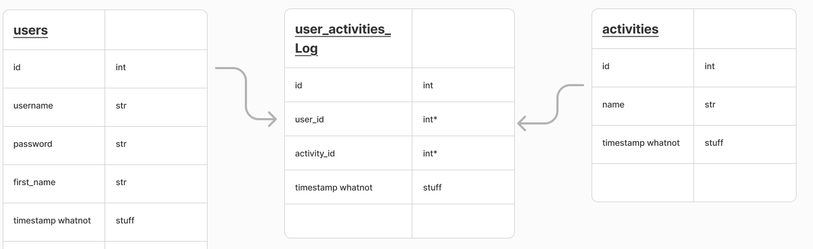

# MOOD BOOST (Back End)

Mood Boost offers simple breathing exercises, inspiring quotes, and a touch of humor to brighten your day and put a smile on your face.  

This is the backend portion of the application that contains the database for user accounts and activity tracking/usage inside the front end application.  The Mood Boost Front End can be found [here](https://github.com/Mood-Boost/mood_boost_fe).

### Deployed Site
[Mood Boost](http://mood-boost-fe.onrender.com/)

## Purpose
The Mood Boost App is designed to enhance users' emotional well-being through engaging and interactive features and was built using a Service-Oriented Architecture (SOA) with a Rails API backend and React frontend.

## Goals
- Deliver a Functional Solution: Address a real-world problem with practical and user-friendly features.
- Emphasize Team Collaboration: Foster teamwork, project management, and decision-making skills in a multi-app system.
- Enhance Professional Readiness: Provide hands-on experience with SOA, external APIs, and deployment, preparing developers for industry challenges.
- Prioritize User Empathy: Create an inclusive, user-centered design by developing detailed user stories and conducting equity analyses.

## Getting Started
Clone down the resposity to your location machine, cd into the direcotry and run: 
- bundle install
- rails db:{drop,create,migrate,seed} or rails db:reset

At this point you can run the backend and run the test suite or test backend functionalality by launching the server from the command prompt:
- rails s or rails server

To see the app fully functioning you will also need to clone down the front end and run that as well.

## Technology Used

- Ruby v3.2
- Rails v7.1
- Faraday
- JSONAPI-Serializer

## System Dependencies
- Faraday
- JSONAPI-Serializer

These are included as gems and installed when bundle install is run from the command prompt.

## Database Creation/Initialization

From the command prompt run:
- rails db:{drop,create,migrate,seed} or rails db:reset

## Test Suite
- RSpec
- Factory Bot
- Faker
- Shoulda-Matchers
- SimpleCov

To run the RSpec tests from the command prompt run: 
- bundle exec rspec spec

* Deployment instructions

## Contributors
- Danielle Cardona [github](https://github.com/dcardona23) [LinkedIn](https://www.linkedin.com/in/danielle-cardona-se/)
- Karl Fallenius [github](https://github.com/SmilodonP) [LinkedIn](https://www.linkedin.com/in/karlfallenius/)
- Michael O'Brien [github](https://github.com/MiTOBrien) [LinkedIn](https://www.linkedin.com/in/michaelobrien67/)
- Paul Knapp [github](https://github.com/Paul-Knapp) [LinkedIn](https://www.linkedin.com/in/paul-m-knapp/)
- Terra Manning [github](https://github.com/TDManning) [LinkedIn](https://www.linkedin.com/in/terra-manning/)